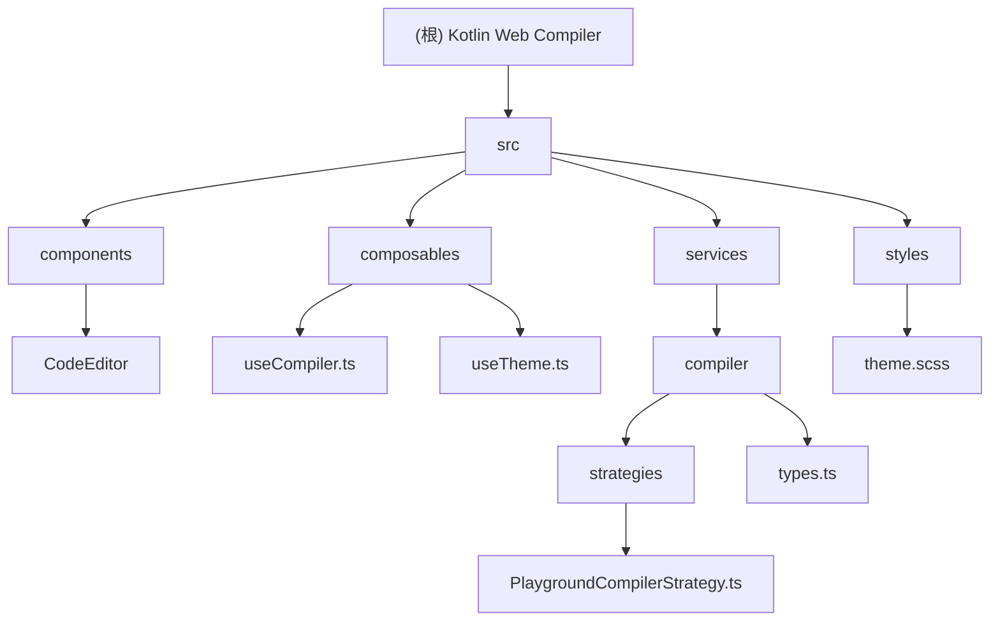

# Kotlin Web Compiler

> 在浏览器中编译并运行 Kotlin 代码的 Web 应用

## 变更记录 (Changelog)

### 2025-12-24 18:07:09
- 初始化项目文档
- 完成全仓扫描与架构分析
- 生成模块结构图与索引

---

## 项目愿景

Kotlin Web Compiler 是一个基于 Web 的 Kotlin 代码编译器，允许用户在浏览器中编写、编译和运行 Kotlin 代码。项目旨在提供类似 [Kotlin Playground](https://play.kotlinlang.org/) 的在线开发体验。

### 核心特性
- 实时代码编辑（基于 Monaco Editor）
- Kotlin 到 JavaScript 的编译与执行
- 深色/浅色主题切换
- 编译错误可视化显示
- 控制台输出捕获

---

## 架构总览

### 技术栈

| 层级 | 技术 |
|------|------|
| 前端框架 | Vue 3.5 + TypeScript 5.7 |
| 构建工具 | Vite 6.0 |
| 代码编辑器 | Monaco Editor 0.52 |
| 状态管理 | Composition API |
| 样式预处理器 | Sass |
| 编译服务 | Kotlin Playground API (JetBrains 官方) |

### 架构模式
- **SPA 单页应用**：纯前端应用，无后端服务
- **策略模式**：编译器服务采用策略接口设计，便于扩展其他编译器
- **组合式 API**：使用 Vue 3 Composition API 进行状态管理
- **沙箱执行**：使用 iframe 隔离执行环境

---

## 模块结构图



---

## 模块索引

| 模块路径 | 职责描述 | 语言 | 状态 |
|----------|----------|------|------|
| [`src/components/CodeEditor`](#src-components-codeeditor) | Monaco 编辑器封装 | TypeScript/Vue | 可用 |
| [`src/composables/useCompiler`](#src-composables-usecompiler) | 编译与执行逻辑 | TypeScript | 可用 |
| [`src/composables/useTheme`](#src-composables-usetheme) | 主题切换管理 | TypeScript | 可用 |
| [`src/services/compiler`](#src-services-compiler) | 编译器服务层 | TypeScript | 可用 |
| [`src/styles/theme.scss`](#src-styles-theme) | 全局主题样式 | SCSS | 可用 |

---

## 运行与开发

### 环境要求
- Node.js >= 18
- pnpm/npm/yarn

### 开发命令

```bash
# 安装依赖
npm install

# 启动开发服务器（端口 5175）
npm run dev

# 构建生产版本
npm run build

# 预览生产构建
npm run preview
```

### 开发服务器配置
- 端口：`5175`（严格端口模式）
- 路径别名：`@` -> `src/`

---

## 测试策略

**当前状态**：项目未配置测试框架。

**建议**：
- 考虑使用 Vitest 进行单元测试
- 对 `composables` 进行测试覆盖
- 使用 Vue Test Utils 测试组件
- 使用 MSW (Mock Service Worker) 模拟编译 API

---

## 编码规范

### TypeScript 配置
- 严格模式：`strict: true`
- 未使用变量检查：启用
- 路径别名：`@/*` 映射到 `./src/*`

### 代码风格建议
- 使用 Composition API `<script setup>` 语法
- 组件命名：PascalCase（如 `MonacoEditor.vue`）
- Composable 命名：`use` 前缀（如 `useCompiler.ts`）
- 接口命名：`I` 前缀（如 `ICompilerStrategy`）

---

## AI 使用指引

### 项目上下文

这是一个 **Kotlin 在线编译器**，而非简单的计算器。核心工作流程：

1. 用户在 Monaco Editor 中编写 Kotlin 代码
2. 点击「编译」按钮，代码通过 `PlaygroundCompilerStrategy` 发送到 JetBrains 官方 API
3. API 返回编译结果或执行输出
4. 前端显示编译状态、错误信息或控制台输出

### 关键文件说明

| 文件 | 说明 |
|------|------|
| `src/App.vue` | 主应用组件，包含完整的 UI 布局和交互逻辑 |
| `src/composables/useCompiler.ts` | 编译核心逻辑，包含 iframe 沙箱执行 |
| `src/services/compiler/strategies/PlaygroundCompilerStrategy.ts` | 调用 Kotlin Playground API |
| `src/components/CodeEditor/MonacoEditor.vue` | Monaco Editor 集成，从 CDN 动态加载 |

### 常见任务

#### 添加新的编译器后端
实现 `ICompilerStrategy` 接口：

```typescript
export class CustomCompilerStrategy implements ICompilerStrategy {
  readonly name = 'Custom Compiler'
  async compile(code: string, target?: 'js' | 'junit'): Promise<CompileResult> {
    // 实现编译逻辑
  }
  isAvailable(): boolean {
    return true
  }
}
```

#### 修改主题变量
编辑 `src/styles/theme.scss` 中的 CSS 变量：
- `--bg-primary` / `--bg-secondary` / `--bg-tertiary`
- `--text-primary` / `--text-secondary`
- `--accent-color` / `--accent-hover`

#### 扩展 Monaco Editor 配置
在 `MonacoEditor.vue` 的 `create()` 调用中修改编辑器选项。

---

## 外部依赖

### 核心 API
- **Kotlin Playground API**: `https://api.kotlinlang.org/api/2.3.0/compiler/run`
- **Monaco Editor CDN**: `https://cdn.jsdelivr.net/npm/monaco-editor@0.52.0/min`

### 关键 NPM 包
- `vue` 3.5.13 - 前端框架
- `monaco-editor` 0.52.0 - 代码编辑器
- `@vueuse/core` 11.3.0 - 组合式工具集
- `sass` 1.83.4 - 样式预处理器

---

## 已知限制

1. **执行超时**：代码执行限制为 10 秒
2. **API 依赖**：依赖 JetBrains 官方 API，不可用时报错
3. **无持久化**：代码不保存到本地存储（刷新后丢失）
4. **单文件编译**：不支持多文件项目

---

## 项目文件统计

| 类型 | 数量 |
|------|------|
| Vue 组件 | 2 |
| TypeScript 文件 | 5 |
| SCSS 文件 | 1 |
| 配置文件 | 3 |

**总源文件数（排除 node_modules）**: ~11 个
**扫描覆盖率**: 100%

---

## 下一步建议

### 功能增强
- [ ] 添加代码示例模板库
- [ ] 支持本地存储保存代码
- [ ] 添加分享功能（生成 URL）
- [ ] 支持多文件项目编译

### 技术改进
- [ ] 添加单元测试覆盖
- [ ] 配置 ESLint/Prettier
- [ ] 添加 CI/CD 流程
- [ ] 优化 Monaco Editor 加载性能
