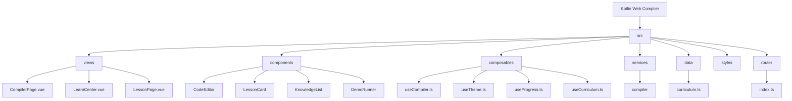

# KotlinLab

> Kotlin 在线学习实验室 - 编译器 + 14天渐进式学习系统

## 变更记录 (Changelog)

### 2025-12-24
- ✨ 新增 14 天 Kotlin 渐进式学习系统
  - Day 1-2: Kotlin 基础、流程控制
  - Day 3-4: 面向对象编程、继承与接口
  - Day 5-6: 集合与泛型、函数式编程
  - Day 7: 空安全与异常处理
  - Day 8: 扩展函数与属性
  - Day 9: 协程基础
  - Day 10: 数据类与密封类
  - Day 11: 标准库与常用函数
  - Day 12: DSL 与高阶技巧
  - Day 13: 实战项目（待办事项管理系统）
  - Day 14: 最佳实践
- 🔧 添加 Vue Router 4 路由系统
- 📝 新增学习中心页面和课程详情页面
- 🐛 修复 Day 5 demo1 未使用变量编译错误
- 🐛 修复文件字符编码乱码问题

### 2025-12-24 18:07:09
- 初始化项目文档
- 完成全仓扫描与架构分析
- 生成模块结构图与索引

---

## 项目愿景

KotlinLab 是一个基于 Web 的 Kotlin 学习平台，提供：
1. **在线编译器**：在浏览器中编写、编译和运行 Kotlin 代码
2. **渐进式学习**：14 天系统化 Kotlin 课程，从基础到实战
3. **交互式 Demo**：每个知识点都有可运行的代码示例
4. **练习系统**：配套练习题巩固学习效果

### 核心特性
- 📝 实时代码编辑（基于 Monaco Editor）
- ▶️ Kotlin 到 JavaScript 的编译与执行
- 🌙 深色/浅色主题切换
- ❌ 编译错误可视化显示
- 📚 14 天渐进式课程体系
- 💾 学习进度本地持久化

---

## 架构总览

### 技术栈

| 层级 | 技术 |
|------|------|
| 前端框架 | Vue 3.5 + TypeScript 5.7 |
| 路由 | Vue Router 4.4 |
| 构建工具 | Vite 6.0 |
| 代码编辑器 | Monaco Editor 0.52 |
| 状态管理 | Composition API |
| 样式预处理器 | Sass |
| 编译服务 | Kotlin Playground API (JetBrains 官方) |

### 架构模式
- **SPA 单页应用**：纯前端应用，无后端服务
- **路由模式**：使用 Vue Router 管理页面导航
- **策略模式**：编译器服务采用策略接口设计，便于扩展
- **组合式 API**：使用 Vue 3 Composition API 进行状态管理
- **数据驱动**：课程内容与代码分离，便于维护

---

## 路由结构

```
/                    # 编译器页面 (默认)
/learn               # 学习中心 - 显示所有课程入口和进度
/learn/day/:day      # 单日课程详情页
```

---

## 模块结构图



---

## 模块索引

### 视图层 (views)
| 模块路径 | 职责描述 |
|----------|----------|
| `CompilerPage.vue` | 编译器主页面，代码编辑与运行 |
| `LearnCenter.vue` | 学习中心，显示 14 天课程概览和进度 |
| `LessonPage.vue` | 单日课程详情，包含知识点和 Demo |

### 组件层 (components)
| 模块路径 | 职责描述 |
|----------|----------|
| `CodeEditor/MonacoEditor.vue` | Monaco 编辑器封装 |
| `LessonCard/LessonCard.vue` | 课程卡片组件 |
| `KnowledgeList/KnowledgeList.vue` | 知识点列表展示 |
| `DemoRunner/DemoRunner.vue` | Demo 代码运行器 |

### 状态管理 (composables)
| 模块路径 | 职责描述 |
|----------|----------|
| `useCompiler.ts` | 编译与执行逻辑 |
| `useTheme.ts` | 主题切换管理 |
| `useProgress.ts` | 学习进度追踪与持久化 |
| `useCurriculum.ts` | 课程数据获取与管理 |

### 数据层 (data)
| 模块路径 | 职责描述 |
|----------|----------|
| `curriculum.ts` | 14 天课程完整数据（56 Demo + 42 练习）|

---

## 课程内容结构

### DayCurriculum 数据结构
```typescript
interface DayCurriculum {
  day: number              // 天数 1-14
  title: string            // 课程标题
  description: string      // 课程描述
  icon: string             // 图标 emoji
  topics: string[]         // 知识点列表
  demos: Demo[]            // Demo 示例
  exercises: Exercise[]    // 练习题
  estimatedTime: number    // 预计学习时间（分钟）
  difficulty: string       // 难度级别
}
```

### 课程大纲
| 天数 | 主题 | 难度 | Demo 数 | 练习数 |
|------|------|------|---------|--------|
| Day 1 | Kotlin 基础 | 入门 | 4 | 3 |
| Day 2 | 流程控制 | 入门 | 4 | 3 |
| Day 3 | 面向对象编程 | 入门 | 4 | 3 |
| Day 4 | 继承与接口 | 入门 | 4 | 3 |
| Day 5 | 集合与泛型 | 中级 | 4 | 3 |
| Day 6 | 函数式编程 | 中级 | 4 | 3 |
| Day 7 | 空安全与异常处理 | 中级 | 4 | 3 |
| Day 8 | 扩展函数与属性 | 中级 | 4 | 3 |
| Day 9 | 协程基础 | 中级 | 4 | 3 |
| Day 10 | 数据类与密封类 | 中级 | 4 | 3 |
| Day 11 | 标准库与常用函数 | 中级 | 4 | 3 |
| Day 12 | DSL 与高阶技巧 | 中级 | 4 | 3 |
| Day 13 | 实战项目 | 高级 | 4 | 3 |
| Day 14 | 最佳实践 | 中级 | 4 | 3 |

---

## 运行与开发

### 环境要求
- Node.js >= 18
- npm/pnpm/yarn

### 开发命令

```bash
# 安装依赖
npm install

# 启动开发服务器（端口 5175）
npm run dev

# 构建生产版本
npm run build

# 预览生产构建
npm run preview
```

### 开发服务器配置
- 端口：`5175`（严格端口模式）
- 路径别名：`@` -> `src/`

---

## 编码规范

### TypeScript 配置
- 严格模式：`strict: true`
- 未使用变量检查：启用（会导致编译错误）
- 路径别名：`@/*` 映射到 `./src/*`

### 代码风格建议
- 使用 Composition API `<script setup>` 语法
- 组件命名：PascalCase（如 `MonacoEditor.vue`）
- Composable 命名：`use` 前缀（如 `useCompiler.ts`）
- 接口命名：`I` 前缀（如 `ICompilerStrategy`）

### 课程代码规范
- 所有 Kotlin 代码必须可运行，无未使用变量
- 字符串模板使用 `\${}` 转义避免 TypeScript 冲突
- 注释使用中文，保持与项目一致

---

## 项目文件统计

| 类型 | 数量 |
|------|------|
| Vue 组件 | 7 |
| TypeScript 文件 | 10 |
| SCSS 文件 | 1 |
| 路由配置 | 1 |
| 课程数据 | 1 (8400+ 行) |

**总源文件数（排除 node_modules）**: ~20 个
**课程内容**: 14 天，56 Demo，42 练习

---

## 已知限制

1. **执行超时**：代码执行限制为 10 秒
2. **API 依赖**：依赖 JetBrains 官方 API，不可用时报错
3. **无云端同步**：学习进度仅存储在本地 localStorage
4. **单文件编译**：不支持多文件项目

---

## 外部依赖

### 核心 API
- **Kotlin Playground API**: `https://api.kotlinlang.org/api/2.3.0/compiler/run`
- **Monaco Editor CDN**: `https://cdn.jsdelivr.net/npm/monaco-editor@0.52.0/min`

### 关键 NPM 包
- `vue` 3.5.13 - 前端框架
- `vue-router` 4.4.5 - 路由管理
- `monaco-editor` 0.52.0 - 代码编辑器
- `@vueuse/core` 11.3.0 - 组合式工具集
- `sass` 1.83.4 - 样式预处理器
